# Nextjs Shopping Kart Paypal 

#### [Same Project without paypal](https://github.com/diegoperea20/Nextjs-Shopping-Kart-and-Prisma-with-Login)

<p align="justify">
Nextjs with Prisma ORM REST API with sqlite where there is a login and register (you can change password and email) where each user can create shopping cart or shopping kart the products and know the total valueand pay with paypal.
</p>

<p align="center">
  
</p>

<p align="justify">
First create an account where you must create a username, password ("Must include at least one number.", "Must include at least one lowercase letter,"Must include at least one lowercase letter.", "Must include at least one uppercase letter.", "Must include at least one uppercase letter.","Must include at least one uppercase letter.", "Must include at least one uppercase letter.", "Must include at least one uppercase letter.","Must include at least one special character.", "Must include at least one special character.", "Must include at least one special character.","The length of the password must be equal to or greater than 8 characters.","Must not contain blank spaces.")  Confirm your password and enter an email address.
</p>

<p align="center">
  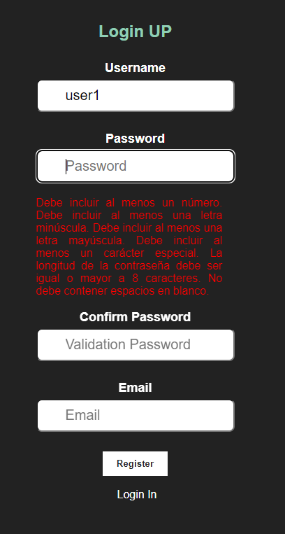
</p>

<p align="justify">
After entering the data correctly, click on the "Register" button.
</p>

<p align="center">
  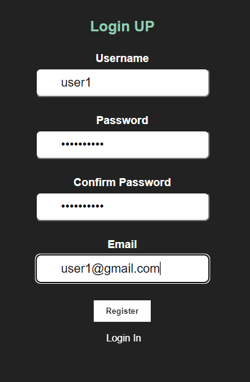
</p>


<p align="justify">
In login enter your username and password, click on the "Login" button.
</p>

<p align="center">
  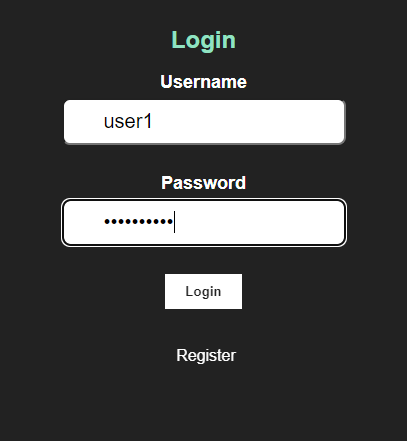
</p>


<p align="justify">
After logging in you will see the home screen where you will see your user name and registration id, in this section you can log out, change your password, delete your account (delete your account and tasks), and create a new task.
</p>

<p align="center">
  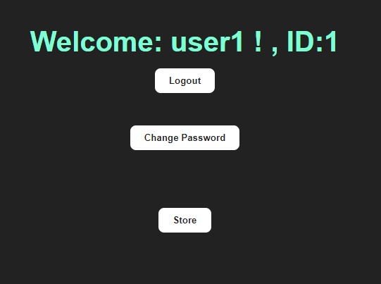
</p>

<p align="justify">
In change password you can change your password and email if required.
</p>

<p align="center">
  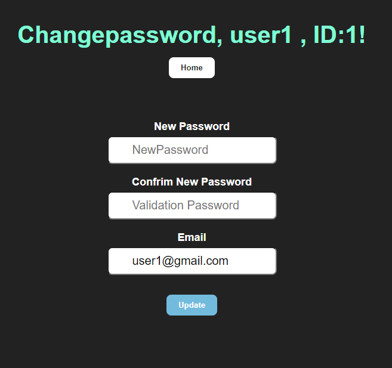
</p>

<p align="justify">
In the store you can see the products, in this case three products, where you can see their image, title, description and price.
</p>

<p align="center">
  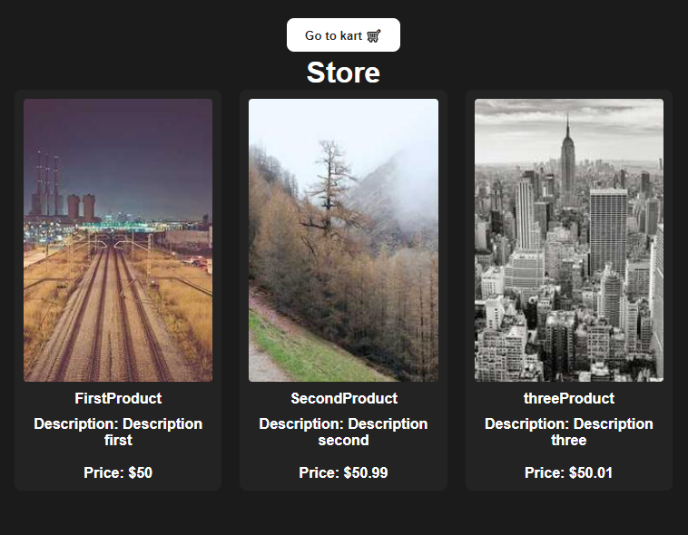
</p>

<p align="justify">
By clicking on each product you can see more detailed information and what quantity is required to add to the shopping cart or kart.
</p>

<p align="center">
  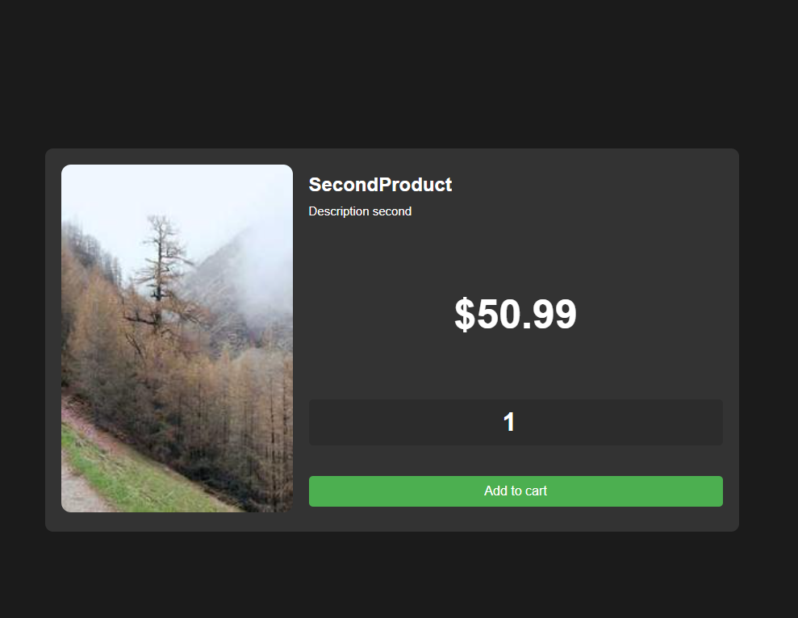
</p>

<p align="justify">
When you are in the shopping cart, the products that have been added to the shopping cart are displayed with all their information and total value.
</p>

<p align="center">
  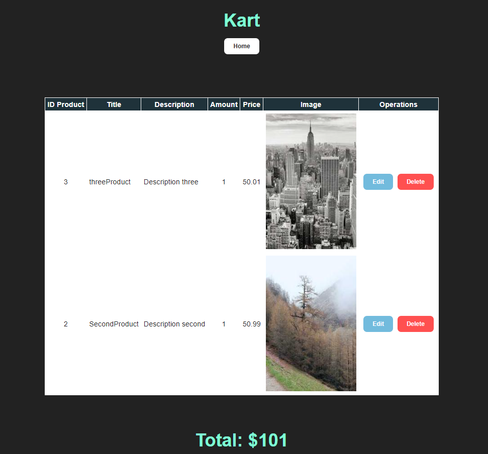
</p>


<p align="justify">
In the operations you can edit and delete the product, in edit you can edit only the amount of product you need and save it with “Save changes” also you can cancel the edit with “Cancel Edit” and once edited the total value is changed.

for example the quantity of the product id 3 is to be edited by 2 quantities
</p>

<p align="center">
  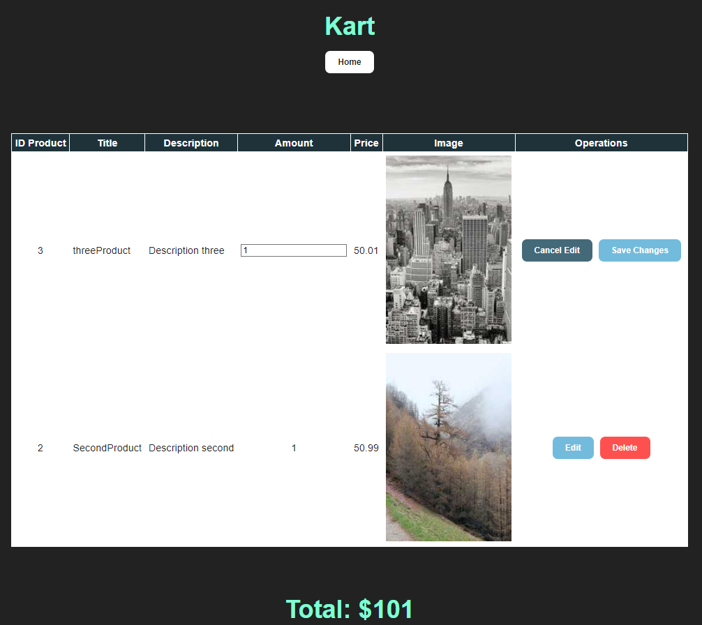
</p>

<p align="center">
  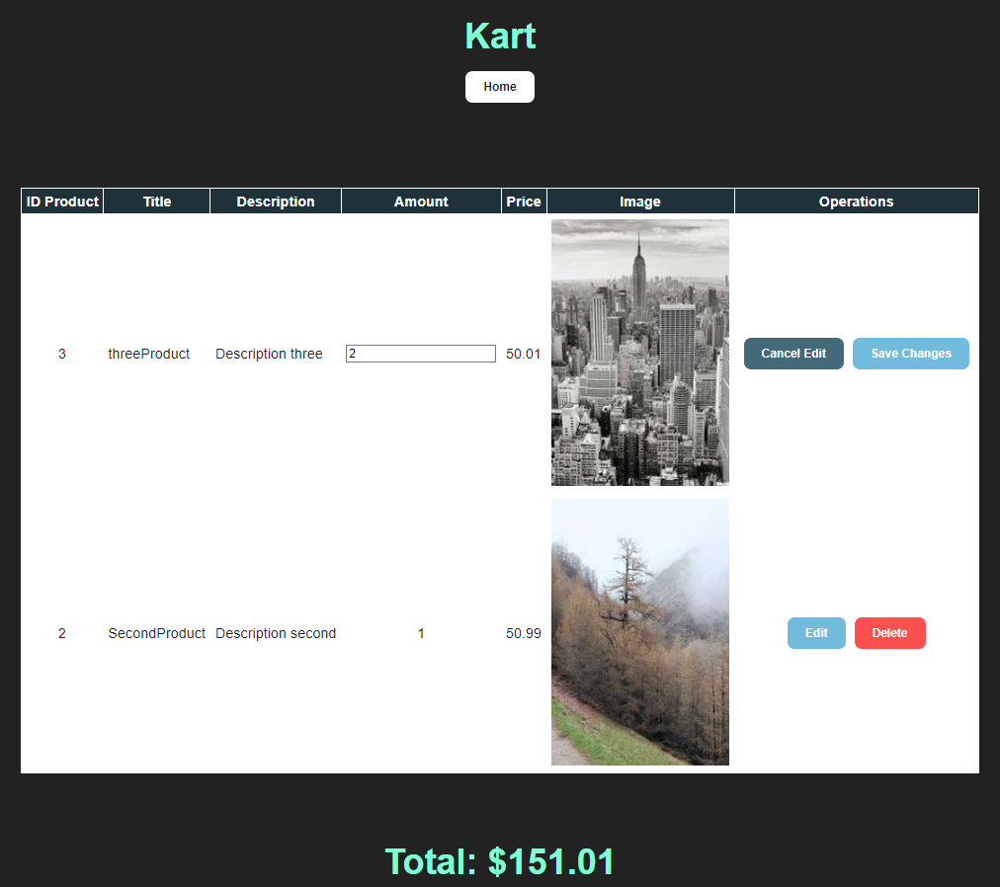
</p>

<p align="center">
  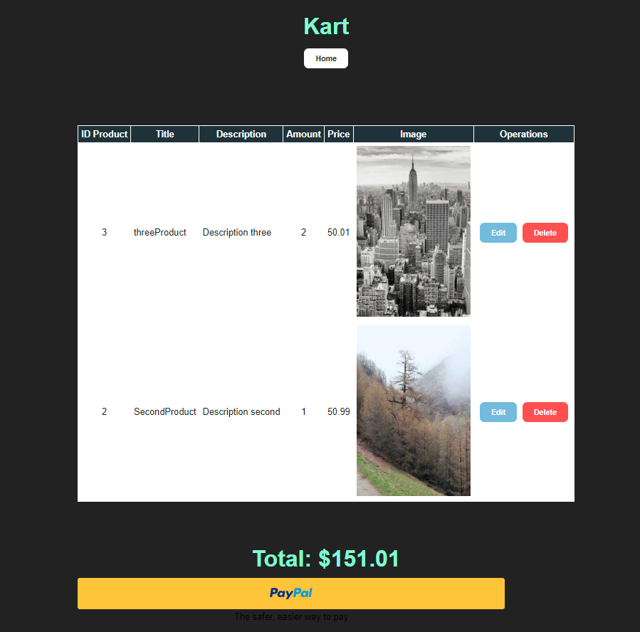
</p>


<p align="justify">
Start the paypal payment process, paypal login is initiated 
</p>

<p align="center">
  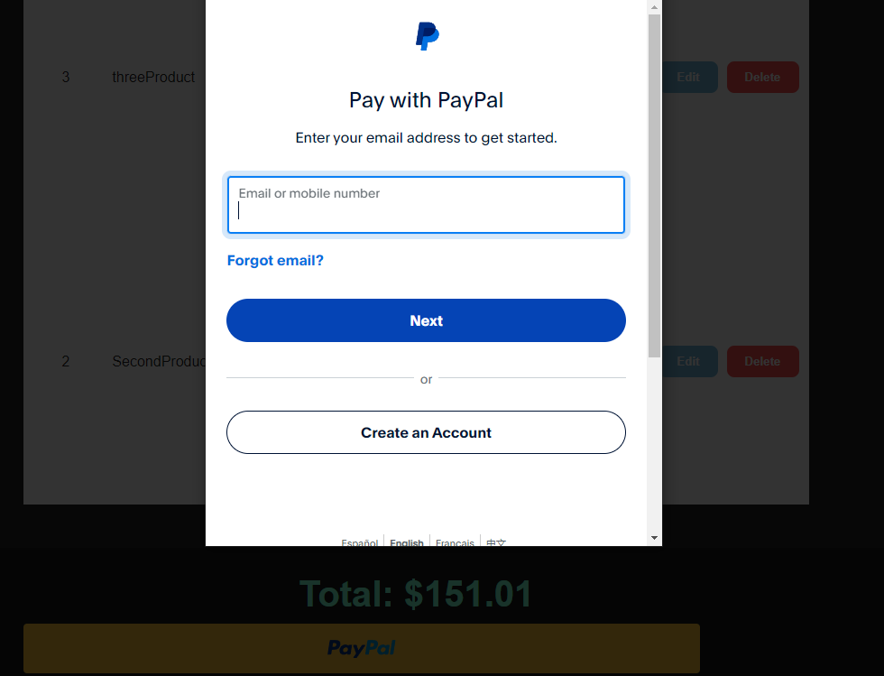
</p>
<p align="justify">
Complete the pay with the correct value
</p>
<p align="center">
  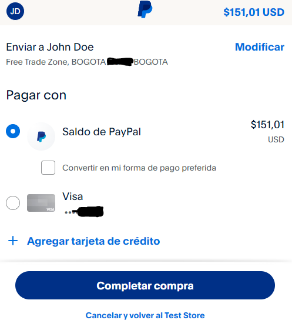
</p>


## Steps to implement it

Go to [paypal developer](https://developer.paypal.com) and login and go to "Apps & Credentials" and copy and paste your client ID y Secret

<p align="center">
  
</p>

And for do the pay o buy with paypal , the testing go to "Testing Tools" in part Sanbox Accounts and copy the emial and  login and put the password and you can do the the testing pay

<p align="center">
  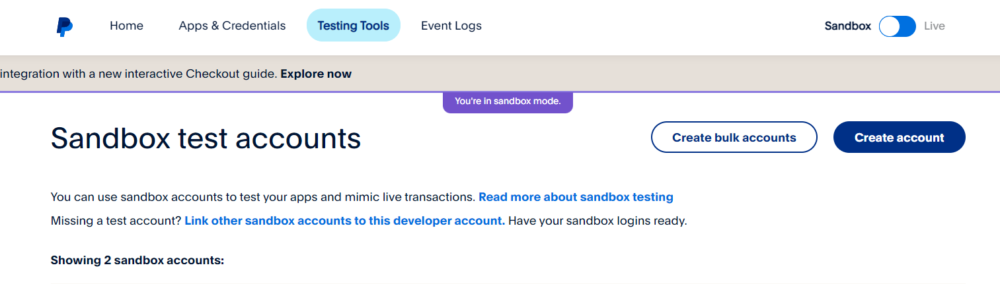
</p>

For see the pays go to the  [Sanbox payl](https://www.sandbox.paypal.com/signin) and login the acount sanbox personal or company

----

Fronted Nextjs Options for do it:


This is a [Next.js](https://nextjs.org/) project bootstrapped with [`create-next-app`](https://github.com/vercel/next.js/tree/canary/packages/create-next-app).

## Getting Started
Nodejs version v20.10.0 and Next.js version v14.2.3 

First
```bash
npm install
```
run the development server:

```bash
npm run dev
# or
yarn dev
# or
pnpm dev
# or
bun dev
```

Open [http://localhost:3000](http://localhost:3000) with your browser to see the result.

## Resolve : Error Nextjs Parsing error: Cannot find module 'next/babel'

Put this code in .eslintrc.json 
```bash
{
  "extends": ["next/babel","next/core-web-vitals"]
}
```


